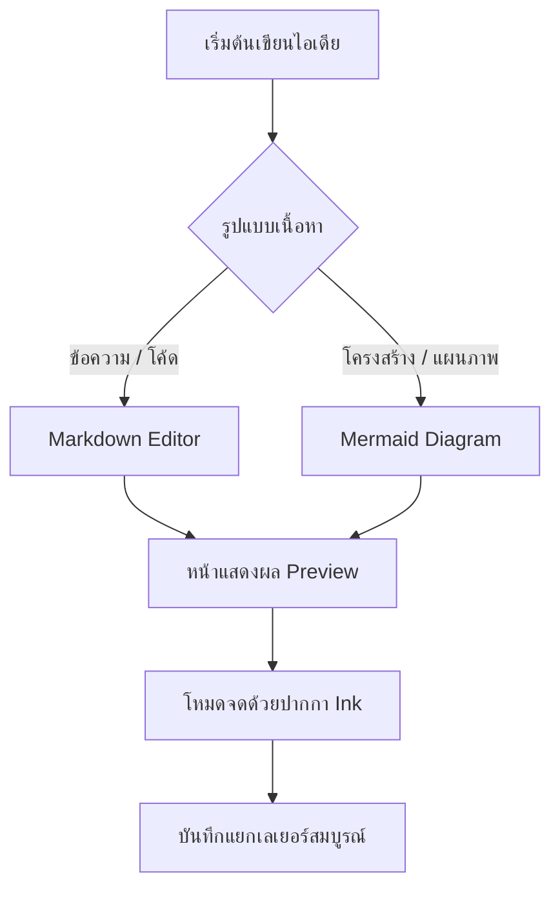

# ยินดีต้อนรับสู่ Mnote

Mnote คือพื้นที่สำหรับอ่าน แก้ไข และจดโน้ตทับ Markdown บน iPad

## เริ่มต้นใช้งาน

1. เลือก **แก้ไข** เพื่อเขียน Markdown
2. เลือก **แสดงผล** เพื่ออ่านเอกสารและดูไดอะแกรม Mermaid
3. เลือก **จด** เพื่อเขียนด้วย Apple Pencil โดยหมึกจะอยู่พิกัดเดิม

## ตัวอย่างไดอะแกรม Mermaid



## ตัวอย่างการจัดรูปแบบ

- รายการหลัก
  - รายการย่อย
- ใช้ **ตัวหนา** หรือ _ตัวเอียง_ เพื่อเน้นข้อความ

> ความคิดดี ๆ เริ่มจากพื้นที่ที่เขียนได้อย่างเป็นธรรมชาติ

---

```dart
void main() {
  print('Read Markdown. Write freely.');
}
```

แก้ไขหรือลบเนื้อหาตัวอย่างนี้ได้ทันที แล้วลองสลับไปยังโหมดจดครับ
