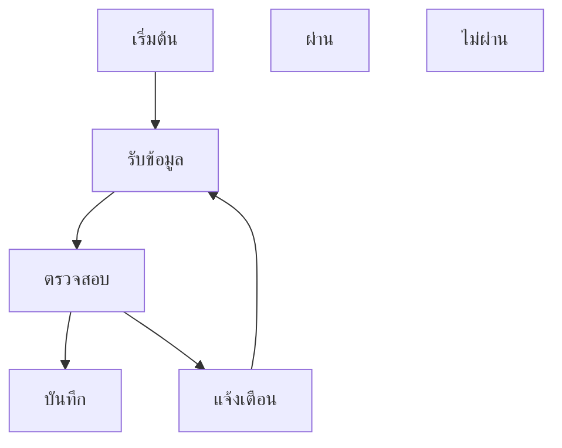
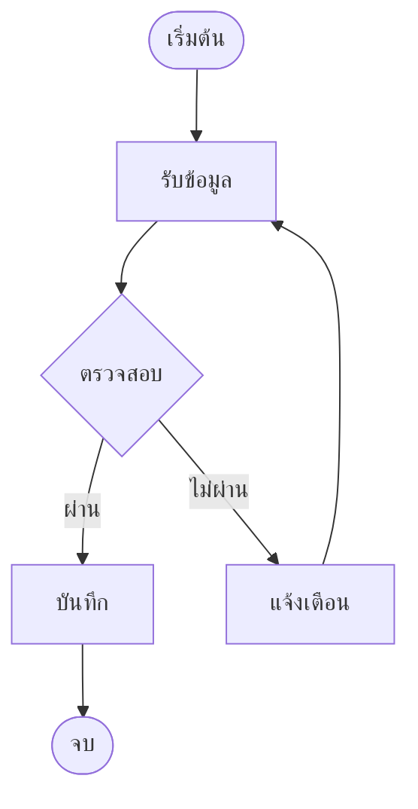

# ประเมินเครื่องมือวาดผังสำหรับเขียนไดอะแกรม Mermaid

เอกสารนี้บันทึกผลการทดสอบไอเดีย "วาดผังด้วยเมาส์แล้วแปลงเป็นโค้ด Mermaid มาใช้ใน Mnote" เพื่อตอบโจทย์ทีมเรื่องการช่วยทุ่นแรงในการเขียนไดอะแกรม (Authoring)

- เครื่องมือที่ทดสอบ: **Draw.io** (diagrams.net) เวอร์ชัน 31.7.0 และ **mermaid.ai** (Mermaid Chart) บนเว็บ
- วันที่ทดสอบ: ตุลาคม 2026
- ผลโดยย่อ:
  - **Draw.io ส่งออกเป็นโค้ด Mermaid ไม่ได้** ไอเดียเดิมของเพื่อนใช้ไม่ได้ตรง ๆ
  - **mermaid.ai ทำได้** วาดด้วยเมาส์แล้วได้โค้ด Mermaid ที่ Mnote วาดได้ทันที เสียเฉพาะตำแหน่งที่จัดเอง
  - ใน Mnote เพิ่ม **ปุ่ม template บน toolbar** สำหรับเริ่มผังง่าย ๆ โดยไม่ต้องออกจากแอป

---

## 1. คำถามที่ต้องการตอบ

การพิมพ์โค้ด Mermaid เองทีละบรรทัดยากและเสียเวลา เพื่อนในทีมเสนอว่าถ้าวาดผังด้วยเมาส์ใน Draw.io แล้วแปลงออกมาเป็นโค้ด Mermaid ได้ ผู้ใช้จะไม่ต้องจำวิธีเขียน Mermaid เลย

การแปลงมีสองทิศ ซึ่งต้องแยกให้ชัด:

| ทิศ | ความหมาย | ไอเดียต้องการ |
|---|---|---|
| ภาพ → โค้ด (ส่งออก) | วาดผังแล้วได้โค้ด Mermaid ออกมา | **ใช่ เป็นหัวใจของไอเดีย** |
| โค้ด → ภาพ (นำเข้า) | วางโค้ด Mermaid แล้วได้ผังในเครื่องมือ | ไม่ใช่สิ่งที่ต้องการโดยตรง |

---

## 2. ผังที่ใช้ทดสอบ

```
เริ่มต้น → รับข้อมูล → ตรวจสอบ (รูปเพชร) ─ผ่าน→ บันทึก → จบ
                              └─ไม่ผ่าน→ แจ้งเตือน → (วนกลับ) รับข้อมูล
```

---

## 3. Draw.io

### 3.1 ช่องทางส่งออกที่ตรวจ

**File > Save as:** ไฟล์ HTML, ไฟล์ XML, ภาพบิตแมปที่แก้ไขได้ (PNG), ภาพเวกเตอร์ที่แก้ไขได้ (SVG) **ไม่มีตัวเลือก Mermaid**

**File > Export as:**

| ตัวเลือก | ได้อะไร | ใช้กับ Mnote ได้ไหม |
|---|---|---|
| PNG | รูปภาพ ฝังข้อมูลผังไว้ให้เปิดแก้ใน Draw.io ได้ | ได้ แทรกเป็นรูปด้วยปุ่มแทรกรูป |
| JPEG, WebP | รูปภาพธรรมดา | ได้ แต่แก้ต่อใน Draw.io ไม่ได้ |
| SVG | รูปเวกเตอร์ | ไม่ได้ Mnote แสดงรูปด้วย widget รูปภาพของ Flutter ซึ่งไม่รองรับ SVG |
| แอนิเมชัน, PDF | วิดีโอ / เอกสาร | ไม่เกี่ยว |
| HTML, XML, URL | ข้อมูลผังในรูปแบบของ Draw.io | ไม่ได้ Mermaid อ่านไม่ออก |
| JSON | ข้อมูลผังแบบย่อ (กล่องกับเส้นเชื่อม) | ไม่ได้โดยตรง ดูหัวข้อ 3.3 |
| ขั้นสูง | หน้าตั้งค่าการส่งออกรูปภาพ (PNG/JPEG/SVG, ขนาด, DPI, พื้นโปร่งใส) | ไม่เกี่ยว |

**ไม่มีตัวเลือก Mermaid**

### 3.2 รูปแบบข้อมูลภายใน (Extras > Edit Diagram)

Draw.io เก็บผังเป็น XML (mxGraph) ซึ่งบันทึกพิกัด ขนาด ฟอนต์ และรูปแบบเส้นของทุกกล่อง ผังทดสอบยาวประมาณ 60 บรรทัด ขณะที่ผังเดียวกันเขียนเป็น Mermaid เหลือไม่ถึง 10 บรรทัด ความต่างมาจากแนวคิด: Draw.io เก็บว่า "แต่ละกล่องอยู่ตรงไหน" ส่วน Mermaid เก็บว่า "อะไรต่อกับอะไร" แล้วจัดวางให้เอง

**ข้อสังเกต:** คำว่า "ผ่าน" และ "ไม่ผ่าน" ในผังทดสอบถูกเก็บเป็นกล่องข้อความลอยแยกต่างหาก ไม่ได้ผูกกับเส้น เพราะตอนวาดใช้การวางกล่องข้อความไว้ใกล้เส้น (วิธีที่ผูกกับเส้นจริงคือดับเบิลคลิกบนตัวเส้นแล้วพิมพ์) ผู้ใช้ทั่วไปมักวาดแบบนี้

### 3.3 JSON: ใกล้เคียงที่สุด แต่ยังไม่พอ

JSON ของ Draw.io 31.7.0 เก็บแค่ชื่อกล่องและเส้นเชื่อม (ต้นทาง → ปลายทาง) ถ้าเขียนตัวแปลงอัตโนมัติ ผังทดสอบจะได้ผลประมาณนี้:



ปัญหาที่พบ:

- **รูปทรงหาย** กล่องเงื่อนไขรูปเพชรกลายเป็นสี่เหลี่ยม
- **ป้ายบนเส้นกลายเป็นกล่องลอย** ("ผ่าน", "ไม่ผ่าน")
- **อักขระพิเศษถูกแปลง** เช่น `>=` ถูกเก็บเป็น `&gt;=`
- **มีกล่องที่ไม่มีชื่อ** (จุดรวมเส้น) ซึ่ง Mermaid ไม่มีรูปแบบที่ตรงกัน
- **ใช้ได้แค่ flowchart** ไดอะแกรมชนิดอื่นของ Mermaid มีความหมายที่ Draw.io ไม่ได้เก็บ

### 3.4 ทิศนำเข้า (โค้ด → ภาพ)

ทดสอบผ่านเมนู **Arrange > Insert > Advanced > Mermaid** วางโค้ด Mermaid แล้ว Draw.io วาดเป็นผังได้ แต่**แปลงผังกลับเป็นโค้ด Mermaid ไม่ได้** แปลว่า Draw.io ใช้ Mermaid เป็นข้อมูลขาเข้าได้อย่างเดียว ไม่ช่วยตอบไอเดียที่ต้องการวาดแล้วได้โค้ด

---

## 4. mermaid.ai

### 4.1 คืออะไร

เว็บของทีมผู้สร้าง Mermaid.js (บริษัท Mermaid Chart) มีทั้งช่องเขียนโค้ด, หน้าแก้ไขแบบลากวางด้วยเมาส์ และการสร้างผังด้วย AI ผลลัพธ์เป็นโค้ด Mermaid โดยตรง ส่งออกเป็นไฟล์ `.mmd` ซึ่งเป็นไฟล์ข้อความที่มีแต่โค้ด Mermaid หน้าเว็บมีปุ่มสมัครใช้งานฟรี (ยังไม่ได้ตรวจข้อจำกัดของแบบฟรี)

### 4.2 ผลการทดสอบ

วาดผังทดสอบด้วยหน้าแก้ไขแบบลากวาง แล้วส่งออกได้โค้ดนี้ (ไฟล์ `.mmd`):



นำโค้ดไปวางในบล็อก ` ```mermaid ` ใน Mnote: **ไดอะแกรมขึ้นถูกต้อง** รูปทรง (วงรี, สี่เหลี่ยม, เพชร), ป้ายบนเส้น, เส้นวนกลับ และภาษาไทยตรงกับที่เห็นในเว็บ

### 4.3 ข้อสังเกต

- **ตำแหน่งที่จัดเองหายไป** โค้ด Mermaid ไม่เก็บตำแหน่งกล่อง Mnote (และ GitHub) จึงจัดวางใหม่ตามกฎของ Mermaid ผังที่ลากจัดไว้ในเว็บอาจเรียงต่างออกไป แต่ความหมาย (อะไรต่อกับอะไร) ครบถ้วน
- **ใช้รูปแบบเขียนใหม่** (`n3@{ shape: diam }`) ซึ่งต้องใช้ Mermaid เวอร์ชัน 11 ช่วงหลัง Mnote ฝัง 11.17.2 จึงรองรับ เครื่องมือหรือเว็บอื่นที่ใช้ Mermaid เวอร์ชันเก่าอาจวาดไม่ได้
- **มี HTML ติดมาในชื่อกล่องบางตัว** (`<span style="color:">`) จากการแก้ข้อความในหน้าลากวาง ไม่อันตรายเพราะ Mnote ตั้ง `securityLevel: 'strict'` ซึ่งกรอง HTML ออก แต่ทำให้โค้ดอ่านยากขึ้น
- **ต้องออนไลน์และผังถูกเก็บบนเซิร์ฟเวอร์ของผู้ให้บริการ** ไม่ขัดกับหลักการของ Mnote ที่ตัวแอปไม่ส่งโน้ตออกนอกเครื่องเอง เพราะเป็นการที่ผู้ใช้เลือกไปใช้เว็บภายนอกด้วยตัวเอง แต่ผู้ใช้ควรรู้ไว้
- **Mnote เปิดไฟล์ `.mmd` ตรง ๆ ไม่ได้** (รับเฉพาะ `.md`, `.markdown`, `.txt`) ต้องคัดลอกโค้ดมาวางในบล็อก ` ```mermaid ` เอง

---

## 5. ข้อสรุป

1. **Draw.io ส่งออกเป็นโค้ด Mermaid ไม่ได้** ตรวจครบทุกตัวเลือกแล้ว ไอเดีย "วาดใน Draw.io แล้วแปลง" ใช้ไม่ได้ตรง ๆ และการเขียนตัวแปลงเองจาก JSON ไม่คุ้ม เพราะเสียรูปทรงและป้ายบนเส้น
2. **mermaid.ai ตอบไอเดียเดิมได้** วาดด้วยเมาส์แล้วได้โค้ด Mermaid ที่ Mnote วาดได้ทันที เหมาะกับผังซับซ้อน ข้อแลกคือต้องออนไลน์ และตำแหน่งที่จัดเองไม่ถูกเก็บ
3. **ใน Mnote เพิ่มปุ่ม template บน toolbar** สำหรับผังง่าย ๆ ที่อยากเริ่มเร็ว ใช้ออฟไลน์ ไม่ต้องสมัครหรือออกจากแอป

| ทาง | แก้ใน Mnote ได้ | ได้รูปทรงครบ | ใช้ออฟไลน์ | สถานะ |
|---|---|---|---|---|
| Draw.io ส่งออก Mermaid | ทำไม่ได้ | | | ไม่มีในเครื่องมือ |
| ตัวแปลงจาก JSON ของ Draw.io | ได้ | ไม่ได้ | ได้ | ไม่ทำ |
| Draw.io ส่งออก PNG แทรกเป็นรูป | ไม่ได้ | ได้ | ได้ | ใช้ได้ แต่ไม่แนะนำ |
| **mermaid.ai คัดลอกโค้ดมาวาง** | **ได้** | **ได้** | ไม่ได้ | **แนะนำสำหรับผังซับซ้อน** |
| **ปุ่ม template บน toolbar** | **ได้** | **ได้** | **ได้** | **ทำใน Mnote** |

---

## 6. แนวคิดสำหรับอนาคต

- ให้ Mnote เปิดไฟล์ `.mmd` ได้ โดยแสดงเป็นไดอะแกรมทั้งไฟล์
- ถ้าต้องการรองรับผังจาก Draw.io จริงจัง ตัวแปลงจาก JSON เป็นจุดเริ่มต้นที่ง่ายที่สุด แต่ต้องกำหนดวิธีวาดที่รองรับให้ผู้ใช้ทราบ และยอมรับว่าผลลัพธ์ต้องตรวจทานก่อนใช้