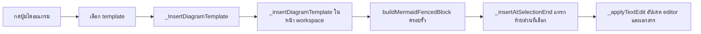
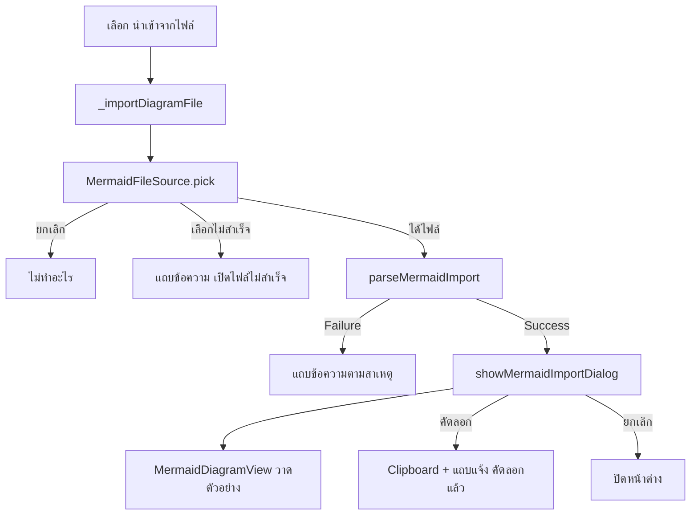

# Mermaid Diagram Authoring

เอกสารนี้อธิบายเครื่องมือช่วยเขียนไดอะแกรม Mermaid ใน Mnote: ปุ่มแทรกโครงไดอะแกรมสำเร็จรูป (template) และการนำเข้าไฟล์ `.mmd` แบบดูตัวอย่างก่อนคัดลอก ทำอะไรได้ ใช้วิธีไหนและเพราะอะไร ข้อมูลไหลผ่านไฟล์ใดบ้าง ทดสอบอย่างไร และถ้าจะต่อยอดต้องทำอย่างไร

- Branch: `feature/diagram-authoring`
- ต่อยอดจากงานแสดงไดอะแกรม: [`mermaid-preview.md`](mermaid-preview.md)
- ผลการประเมินเครื่องมือวาดผังภายนอก: [`drawio-mermaid-evaluation.md`](drawio-mermaid-evaluation.md)
- สถานะ: ใช้งานได้บน Android (ทดสอบบนแท็บเล็ตจริงแล้ว)

---

## 1. ปัญหาและแนวทาง

การพิมพ์โค้ด Mermaid เองทีละบรรทัดยากและเสียเวลา ผู้ใช้ต้องจำรูปแบบการเขียน เช่น `{ }` คือกล่องเงื่อนไข หรือ `-->|ผ่าน|` คือเส้นที่มีป้าย

ทีมเสนอให้ลองวาดผังใน Draw.io แล้วแปลงเป็นโค้ด ผลการประเมิน (ดูเอกสารประเมิน) สรุปว่า:

| ทาง | ผล |
|---|---|
| Draw.io แปลงผังเป็นโค้ด Mermaid | **ทำไม่ได้** ไม่มีตัวเลือกส่งออก Mermaid |
| mermaid.ai (เว็บของทีมผู้สร้าง Mermaid) | **ทำได้** ส่งออกเป็นไฟล์ `.mmd` ที่ Mnote วาดได้ แต่ต้องออนไลน์ |
| ปุ่มบน toolbar ของ Mnote | ใช้ได้ในแอป ออฟไลน์ ไม่ต้องสมัคร |

งานนี้จึงทำ 2 อย่างในแอป:

1. **ปุ่มแทรก template** สำหรับผังง่าย ๆ ที่อยากเริ่มเร็ว
2. **นำเข้าไฟล์ `.mmd`** สำหรับผังซับซ้อนที่วาดใน mermaid.ai แล้วส่งออกมา ไม่ต้องเปิดไฟล์ไปคัดลอกเอง

---

## 2. ความสามารถ

### 2.1 ปุ่ม "ไดอะแกรม" บน toolbar

ปุ่มไอคอนแผนผัง อยู่ถัดจากปุ่ม "โค้ด" ในหน้าแก้ไข เปิดเมนู:

| รายการ | ผลลัพธ์ |
|---|---|
| ผังงาน (Flowchart) | แทรกผังที่มีจุดเริ่ม, ขั้นตอน, เงื่อนไข, ป้ายบนเส้น และเส้นวนกลับ |
| ลำดับการทำงาน (Sequence) | แทรกผังผู้ใช้กับระบบส่งคำขอและตอบกลับ |
| คลาส (Class) | แทรกผัง 2 class พร้อมความสัมพันธ์ |
| นำเข้าจากไฟล์ .mmd… | เปิดหน้าต่างเลือกไฟล์ (หัวข้อ 2.2) |

การแทรก template:
- แทรกที่**ท้าย**ข้อความที่เลือกไว้ ไม่ลบข้อความที่ผู้ใช้เลือก
- ถ้าเคอร์เซอร์อยู่กลางบรรทัด เติมบรรทัดใหม่ข้างหน้าให้ รั้ว ` ```mermaid ` จึงขึ้นต้นบรรทัดเสมอ (ไม่อย่างนั้น Markdown ไม่นับเป็นบล็อก)
- เคอร์เซอร์ไปอยู่หลังบล็อก พิมพ์ต่อได้ทันที
- กด "เลิกทำ" (undo) ได้ และสถานะเอกสารเปลี่ยนเป็น "ยังไม่ได้บันทึก" ถูกต้อง
- บนจอแคบ ปุ่มถูกยุบเข้าเมนู `...` ของ toolbar และยังเลือก template ได้

### 2.2 นำเข้าไฟล์ `.mmd`

1. เลือก "นำเข้าจากไฟล์ .mmd…" แล้วเลือกไฟล์จากเครื่อง
2. ระบบตรวจไฟล์ ถ้าผิดแสดงแถบข้อความแจ้ง (หัวข้อ 4)
3. ถ้าถูก เปิดหน้าต่างตัวอย่าง: ชื่อไฟล์, **ภาพไดอะแกรม** และส่วน "ดูโค้ด" ที่กดเปิดได้
4. กด "คัดลอกโค้ด" ได้โค้ดที่ครอบ ` ```mermaid ` แล้ว พร้อมแถบแจ้ง "คัดลอกแล้ว วางในโน้ตได้เลย"
5. ผู้ใช้วางเองในตำแหน่งที่ต้องการ

**การนำเข้าไม่แทรกลงโน้ตเอง** ผู้ใช้เห็นก่อนว่าไดอะแกรมถูกต้อง (ถ้าไฟล์มีโค้ดผิด จะเห็นกล่อง error ในหน้าต่างตัวอย่าง) และเลือกตำแหน่งวางเอง วางในโน้ตอื่นหรือที่อื่นนอกแอปก็ได้

รองรับนามสกุล `.mmd` และ `.mermaid` (ไม่สนตัวพิมพ์)

---

## 3. วิธีที่เลือกและเหตุผล

| เรื่อง | สิ่งที่เลือก | เหตุผล |
|---|---|---|
| รูปแบบโค้ดใน template | รูปแบบดั้งเดิม (`[ ]`, `{ }`, `([ ])`) ไม่ใช้ `@{ shape: ... }` | วาดได้กับ Mermaid ทุกเวอร์ชัน ผู้ใช้เอาไปวางที่ไหนก็ได้ |
| ชื่อตัวระบุใน template | ภาษาอังกฤษ (`U as ผู้ใช้`, class `Note`) ข้อความที่แสดงเป็นไทย | ไดอะแกรมบางชนิดไม่รองรับภาษาไทยในชื่อตัวระบุ |
| ข้อมูล template | ไฟล์ Dart ล้วน แยกจาก toolbar | เพิ่มหรือแก้ template ได้โดยไม่แตะ toolbar และ test ได้ครบ |
| ตำแหน่งปุ่ม | ถัดจากปุ่ม "โค้ด" ใช้ `_ToolbarMenuButton` ของทีม | ไดอะแกรมก็คือบล็อกโค้ดชนิดหนึ่ง ผู้ใช้หาเจอในจุดที่คาด และได้ขนาดกับสีตาม MD3 เท่าปุ่มอื่น |
| พารามิเตอร์ของ toolbar | optional และ nullable | ที่อื่นที่สร้าง toolbar ยัง compile ผ่าน ปุ่มแสดงเมื่อมี callback |
| ค่าในเมนู | sealed class `_DiagramMenuAction` (แทรก template / นำเข้าไฟล์) | เมนูเดียวมีการกระทำคนละชนิด `switch` แบบ sealed บังคับให้จัดการครบทุกกรณี |
| ตัวเลือกไฟล์ | `FileType.any` แล้วตรวจนามสกุลเอง | Android ไม่รู้จักนามสกุล `.mmd` ถ้ากรองด้วย `allowedExtensions` อาจเลือกไฟล์ไม่ได้เลย |
| ตัวเลือกไฟล์อยู่ที่ไหน | `data/mermaid_file_source.dart` แบบ interface + `Device...` | ตามโครงสร้างของทีม (`data/` คือส่วนที่คุยกับอุปกรณ์) และแบบเดียวกับ `ink_file_storage.dart` จึงใส่ตัวปลอมใน test ได้ |
| ตรวจไฟล์ | ฟังก์ชันล้วน `parseMermaidImport` | ทุกกรณีผิดพลาด test ได้โดยไม่ต้องเปิดหน้าต่างเลือกไฟล์จริง |
| ผลการตรวจ | sealed class `MermaidImportSuccess` / `MermaidImportFailure` | แบบเดียวกับข้อความจาก WebView ผู้เรียกต้องจัดการทั้งสองกรณี |
| หน้าต่างตัวอย่าง | จอแคบ (< 600): `Dialog.fullscreen` / จอกว้าง: `Dialog` กว้างสุด 720 | MD3 แนะนำหน้าต่างเต็มจอบนมือถือเมื่อเนื้อหาซับซ้อน (ภาพไดอะแกรมกับโค้ด) |
| ปุ่มในหน้าต่าง | คัดลอก: `FilledButton` ขวาสุด / ยกเลิก: `TextButton` หรือ `CloseButton` | การกระทำหลักเด่นที่สุด การกระทำรองลดความเด่น ตามแบบแผน dialog ของ MD3 |
| การคัดลอก | `Clipboard` ของ Flutter ครอบรั้วด้วย `buildMermaidFencedBlock` | ไม่ต้องเพิ่มแพ็กเกจ วางใน Mnote หรือ GitHub แล้วเป็นไดอะแกรมทันที |
| ความยาวรั้ว | ยาวกว่า backtick ที่ยาวที่สุดในโค้ดอย่างน้อย 1 ตัว (ขั้นต่ำ 3) | ถ้าในโค้ดมี ` ``` ` แล้วครอบด้วยรั้ว 3 ตัว บล็อกจะปิดก่อนเวลา |

---

## 4. การตรวจไฟล์นำเข้า

`parseMermaidImport` ตรวจตามลำดับ เจอข้อไหนผิดหยุดทันที:

| ลำดับ | ตรวจ | ข้อความที่ผู้ใช้เห็น |
|---|---|---|
| 1 | นามสกุลเป็น `.mmd` หรือ `.mermaid` | รองรับเฉพาะไฟล์ .mmd หรือ .mermaid |
| 2 | ขนาดไม่เกิน 100 KB (`mermaidImportMaxBytes`) | ไฟล์ใหญ่เกินไป (สูงสุด 100 KB) |
| 3 | อ่านเป็นข้อความ UTF-8 ได้ | อ่านไฟล์ไม่ได้ ไฟล์ต้องเป็นข้อความแบบ UTF-8 |
| 4 | ตัด BOM (`\uFEFF`) หน้าไฟล์ | (ไม่แจ้ง ทำให้อัตโนมัติ) |
| 5 | ถ้าทั้งไฟล์ครอบ ` ```mermaid ` อยู่แล้ว แกะออก | (ไม่แจ้ง กันรั้วซ้อนสองชั้นตอนคัดลอก) |
| 6 | ทำความสะอาดด้วย `normalizeMermaidSource` | (ไม่แจ้ง) |
| 7 | เหลือเนื้อหาจริง | ไฟล์ว่าง ไม่มีโค้ดไดอะแกรม |

**ไฟล์ถูกอ่านแบบ stream ไม่เกิน 100 KB + 1 byte** (`readLimitedBytes` ใน `mermaid_file_source.dart`) ไฟล์ใหญ่แค่ไหนก็ไม่ถูกโหลดเข้าหน่วยความจำทั้งก้อน ส่วนเกินที่อ่านมา 1 byte ทำให้ขั้นตรวจขนาดรู้ว่าไฟล์ใหญ่เกิน

---

## 5. การทำงานจากต้นจนจบ

### แทรก template



### นำเข้าไฟล์



---

## 6. ไฟล์ที่เกี่ยวข้อง

### ไฟล์ใหม่

| ไฟล์ | หน้าที่ | ขึ้นกับ Flutter |
|---|---|---|
| `presentation/mermaid/mermaid.dart` | ไฟล์รวม (barrel) ส่งออกสิ่งที่ใช้จากภายนอก | - |
| `presentation/mermaid/mermaid_templates.dart` | `MermaidTemplate`, `mermaidTemplates`, `buildMermaidFencedBlock` | ไม่ |
| `presentation/mermaid/mermaid_file_import.dart` | `parseMermaidImport`, `MermaidImportResult` และผลลัพธ์ 2 แบบ, `mermaidImportMaxBytes` | ไม่ |
| `presentation/mermaid/mermaid_import_dialog.dart` | `showMermaidImportDialog` หน้าต่างตัวอย่างแบบปรับตามจอ | ใช่ |
| `data/mermaid_file_source.dart` | `MermaidFileSource` (interface), `DeviceMermaidFileSource`, `PickedMermaidFile` | ใช้ `file_picker` |
| `docs/drawio-mermaid-evaluation.md` | ผลการประเมิน Draw.io และ mermaid.ai | - |

(path ทั้งหมดอยู่ใต้ `lib/features/workspace/` ยกเว้นเอกสาร)

### ไฟล์ร่วมของทีมที่แก้

| ไฟล์ | สิ่งที่เปลี่ยน | จำนวนบรรทัด |
|---|---|---|
| `markdown_formatting_toolbar.dart` | import ไฟล์รวม, พารามิเตอร์ optional 2 ตัว, ปุ่มไดอะแกรม, sealed class ของเมนู, ฟังก์ชันเลือกไอคอน | เพิ่มอย่างเดียว ไม่แก้โค้ดเดิม |
| `markdown_workspace_page.dart` | import ไฟล์รวม (แทน import เดิมของ Viewer), import ตัวเลือกไฟล์, พารามิเตอร์ `mermaidFileSource`, เมธอด `_insertDiagramTemplate` และ `_importDiagramFile`, ส่ง callback 2 บรรทัด | +45 / -1 |

**ไม่ได้รัน `dart format` กับ `markdown_workspace_page.dart`** เพราะไฟล์บน main ย่อหน้าเพี้ยนในเมธอด `build` (น่าจะมาจากการแก้ conflict ตอน merge) ถ้า format จะได้ diff ก้อนใหญ่ในโค้ดของเพื่อน การเปลี่ยนแปลงของเราจัดรูปแบบถูกต้องอยู่แล้ว

ไม่มีการเพิ่ม dependency ใหม่ (`file_picker` มีอยู่ในโปรเจกต์แล้ว)

---

## 7. ความปลอดภัย

| ความเสี่ยง | มาตรการ | test ที่ยืนยัน |
|---|---|---|
| ไฟล์ใหญ่ผิดปกติทำให้แอปค้างหรือหน่วยความจำเต็ม | อ่านแบบ stream หยุดที่ 100 KB + 1 byte แล้วตรวจขนาด | `mermaid_file_source_test.dart` (Security) หยุดอ่านทันทีที่ครบ, `mermaid_file_import_test.dart` (Security) ขนาดเกิน |
| ไฟล์ไม่ใช่ข้อความ (รูปภาพ, ไฟล์เสีย) | จับ `FormatException` แสดงข้อความแจ้ง ไม่แทรกขยะ ไม่ crash | `mermaid_file_import_test.dart` (Security) bytes ไม่ใช่ UTF-8 |
| โค้ดอันตรายในไฟล์ `.mmd` | หน้าต่างตัวอย่างใช้ `MermaidDiagramView` ตัวเดียวกับหน้าแสดงผล ได้มาตรการทั้งหมดใน [`mermaid-preview.md`](mermaid-preview.md) หัวข้อ 5 (CSP, strict, ส่งโค้ดเป็นข้อความ) | test ใน `mermaid_html_test.dart` |
| เนื้อหาในไฟล์ปิดรั้วก่อนเวลาแล้วหลุดเป็น Markdown | รั้วยาวกว่า backtick ในโค้ด | `mermaid_templates_test.dart` รั้ว 4 และ 5 ตัว |
| แอปส่งข้อมูลออกนอกเครื่อง | ไม่มี ทั้งการแทรกและนำเข้าทำงานในเครื่องทั้งหมด | - |

---

## 8. การทดสอบ

### test อัตโนมัติ (`test/features/workspace/presentation/mermaid/`)

| ไฟล์ | จำนวน | ครอบคลุม |
|---|---|---|
| `mermaid_templates_test.dart` | 5 | จำนวนและ id ไม่ซ้ำ, ไม่มีช่องว่างเกิน, บรรทัดแรกตรงชนิด, ความยาวรั้ว, ทุก template ไปถึง widget ไดอะแกรมได้จริง |
| `mermaid_file_import_test.dart` | 9 | นามสกุล (รวมตัวพิมพ์ใหญ่), ขนาดเกิน, ไม่ใช่ UTF-8, BOM, แกะรั้ว, ไฟล์ว่าง, ไฟล์จริงจาก mermaid.ai |
| `mermaid_import_dialog_test.dart` | 5 | หน้าต่าง, ชื่อไฟล์, ภาพตัวอย่าง, ดูโค้ด, คัดลอกเข้า clipboard, ยกเลิก, แบบเต็มจอบนจอแคบ |
| `mermaid_toolbar_test.dart` | 9 | ผ่านแอปจริง: แทรก template บนแท็บเล็ต, แทรกต่อข้อความเดิม, undo, จอมือถือผ่านเมนู `...`, ครบวงจรถึงหน้าแสดงผล, เมนูนำเข้า, ไฟล์ถูก (เปิดหน้าต่างและไม่แทรกเอง), ไฟล์ผิด, ยกเลิก |

ผลล่าสุด: test ทั้งโปรเจกต์ **166** ตัวผ่าน (จาก 135 ก่อนเริ่มงานนี้), coverage ทั้งโปรเจกต์ **77.4%** (จาก 76.3%)

**เทคนิคที่ใช้ใน test:**
- **หน้า workspace โหลด `welcome.md` เป็นเนื้อหาเริ่มต้นเอง** test จึงล้าง editor ด้วย `enterText` ก่อนเสมอ
- **รอ 600ms หลังแก้ข้อความ** เพราะ Flutter รวมการแก้ที่ห่างกันไม่ถึง 500ms เป็นประวัติ undo ก้อนเดียว
- **ดักคลิปบอร์ด** ด้วย `setMockMethodCallHandler(SystemChannels.platform, ...)` จับคำสั่ง `Clipboard.setData`
- **ตัวเลือกไฟล์ปลอม** `_FakeMermaidFileSource` คืนไฟล์ที่กำหนด หรือ `null` แทนการยกเลิก

### ทดสอบบนเครื่องจริง (แท็บเล็ต Android)

ผ่านทั้งหมด: แทรก template ครบ 3 แบบแล้วหน้าแสดงผลวาดได้, undo, จอแคบปุ่มย้ายเข้าเมนู `...`, โหมดมืด, เลือกไฟล์ `.mmd` จากหน้าต่างเลือกไฟล์ของ Android ได้, หน้าต่างตัวอย่างแสดงไดอะแกรม, ดูโค้ด, คัดลอกแล้ววางในโน้ตได้ไดอะแกรม, ไฟล์ผิดชนิดได้แถบแจ้งโดยแอปไม่พัง, จอแคบหน้าต่างเป็นแบบเต็มจอ

---

## 9. การต่อยอด

### เพิ่ม template ใหม่

เพิ่มรายการใน `mermaidTemplates` (`mermaid_templates.dart`) ปุ่มบน toolbar แสดงเองโดยไม่ต้องแก้ไฟล์อื่น

```dart
MermaidTemplate(
  id: 'state',
  label: 'สถานะ (State)',
  source: '''stateDiagram-v2
  [*] --> Draft
  Draft --> Published
  Published --> [*]''',
),
```

- `id` ภาษาอังกฤษที่ไม่เปลี่ยน ใช้ตั้ง Key `toolbar-diagram-<id>`
- ใช้รูปแบบเขียนดั้งเดิมและชื่อตัวระบุภาษาอังกฤษ
- ไม่มีบรรทัดว่างหรือช่องว่างเกินหัวท้าย (test จะเช็ก)
- ถ้าอยากได้ไอคอนเฉพาะ เพิ่มกรณีใน `_diagramTemplateIcon` ของ toolbar
- ปรับ test ข้อ "มี template 3 ตัว" ให้ตรงจำนวนใหม่ และวาง template ในโน้ตบนเครื่องจริงเพื่อยืนยันว่าวาดได้

### ใช้การนำเข้าไฟล์ที่อื่น

```dart
import 'package:mnote/features/workspace/presentation/mermaid/mermaid.dart';

final result = parseMermaidImport(name: fileName, bytes: bytes);
switch (result) {
  case MermaidImportFailure(:final message):
    // แสดง message ให้ผู้ใช้
  case MermaidImportSuccess(:final name, :final source):
    await showMermaidImportDialog(context, fileName: name, source: source);
}
```

ใช้ `parseMermaidImport` อย่างเดียวก็ได้ ถ้าต้องการแค่ตรวจและทำความสะอาดโค้ดจากแหล่งอื่น เช่น ข้อความที่ AI สร้าง

### Key สำหรับ test

| Key | widget |
|---|---|
| `toolbar-diagram` | ปุ่มไดอะแกรม |
| `toolbar-diagram-<id>` | รายการ template ในเมนู (เช่น `toolbar-diagram-flowchart`) |
| `toolbar-diagram-import` | รายการนำเข้าไฟล์ |
| `mermaid-import-dialog` | หน้าต่างตัวอย่าง |
| `mermaid-import-copy` | ปุ่มคัดลอก |
| `mermaid-import-cancel` | ปุ่มยกเลิกหรือปิด |
| `mermaid-import-code-toggle` | ส่วน "ดูโค้ด" |

---

## 10. ข้อจำกัดและแนวคิดสำหรับอนาคต

### ข้อจำกัด

- template มี 3 แบบ (flowchart, sequence, class)
- นำเข้าไฟล์ได้ทีละไฟล์ และเปิดไฟล์ `.mmd` เป็นเอกสารโดยตรงไม่ได้ (หน้าเปิดเอกสารรับ `.md`, `.markdown`, `.txt`)
- ตำแหน่งกล่องที่จัดเองใน mermaid.ai ไม่ถูกเก็บในโค้ด Mermaid Mnote จัดวางใหม่ตามกฎของ Mermaid
