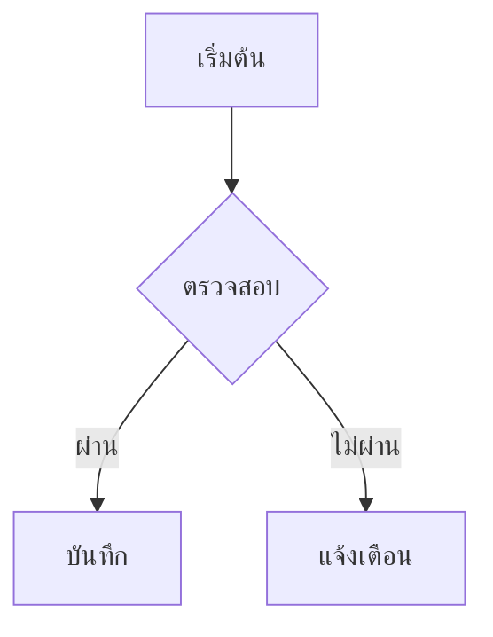
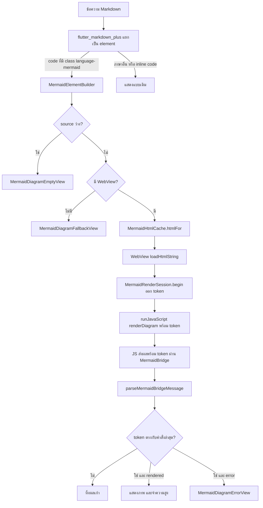

# Mermaid Diagram Preview (Viewer)

เอกสารนี้อธิบายความสามารถแสดงไดอะแกรม Mermaid ในโหมด "แสดงผล" ของ Mnote: ทำอะไรได้ ใช้วิธีไหนและเพราะอะไร ข้อมูลไหลผ่านไฟล์ใดบ้าง ทดสอบอย่างไร และถ้าจะนำไปใช้ที่อื่นต้องทำอย่างไร

- Branch: `feature/mermaid-preview`
- เวอร์ชัน mermaid ที่ฝังในแอป: **11.17.2** (ดู `assets/mermaid/VERSION.txt`)
- สถานะ: ใช้งานได้บน Android (ทดสอบบนแท็บเล็ตจริงแล้ว รวมถึงตอนออฟไลน์)

---

## 1. ความสามารถ

เมื่อเอกสารมีบล็อกโค้ดที่ระบุภาษา `mermaid` เช่น

````markdown

````

หน้า "แสดงผล" จะวาดเป็นไดอะแกรมแทนการแสดงเป็นโค้ด เหมือนที่ GitHub ทำ

- รองรับไดอะแกรมทุกชนิดที่ mermaid 11.17.2 รองรับ (flowchart, sequence, class, state, ER, gantt ฯลฯ) และข้อความภาษาไทย
- ทำงานแบบออฟไลน์ทั้งหมด เนื้อหาโน้ตไม่ถูกส่งออกนอกเครื่อง
- ธีมของไดอะแกรมเปลี่ยนตาม Light/Dark ของแอป
- ชื่อภาษาไม่สนตัวพิมพ์ (` ```Mermaid ` ใช้ได้) และรับข้อความต่อท้ายชื่อภาษาได้ (` ```mermaid title `)
- code block ภาษาอื่นและ inline code แสดงเหมือนเดิมทุกประการ

สถานะที่ผู้ใช้อาจเห็น:

| สถานะ | เมื่อไร |
|---|---|
| กำลังโหลด (วงกลมหมุน) | ระหว่างวาด ปกติไม่เกิน 2-3 วินาทีบนเครื่องทดสอบ |
| ไดอะแกรม | วาดสำเร็จ |
| กล่องสีแดง "แสดงไดอะแกรมไม่ได้" | โค้ดผิด syntax, โหลดไม่สำเร็จ หรือเกิน 10 วินาที จะแสดงข้อความ error ของ mermaid พร้อมโค้ดเดิมที่เลือกคัดลอกได้ |
| "ไดอะแกรมว่าง" | บล็อก mermaid ไม่มีเนื้อหา |
| โค้ดพร้อมข้อความ "แพลตฟอร์มนี้ยังไม่รองรับการแสดงไดอะแกรม" | แพลตฟอร์มไม่มี WebView (Web, Windows, Linux) |

---

## 2. วิธีที่เลือกและเหตุผล

### หลักการ

mermaid ต้องใช้เบราว์เซอร์ในการวาด เพราะต้องวัดขนาดตัวอักษรจริงเพื่อคำนวณขนาดกล่องและตำแหน่งเส้น เราจึงฝังเบราว์เซอร์ขนาดเล็กของระบบ (WebView) ไว้ในหน้า preview และโหลด mermaid ตัวจริงที่เก็บไว้ในแอป ซึ่งเป็นตัวเดียวกับที่ GitHub ใช้

### ทางเลือกที่พิจารณา

| ทางเลือก | ผล | เหตุผล |
|---|---|---|
| **WebView + mermaid ฝังในแอป** | **เลือก** | เหมือน GitHub, ครบทุกชนิด, ออฟไลน์, ข้อมูลไม่ออกนอกเครื่อง, แตะโค้ดของทีมน้อยที่สุด |
| ส่งโค้ดไปให้บริการภายนอกวาด (mermaid.ink, Kroki) | ไม่เลือก | โน้ตของผู้ใช้ออกนอกเครื่อง ขัดกับข้อ Security และแนวทาง local-first, ใช้ออฟไลน์ไม่ได้ |
| วาดเองด้วย Dart / แพ็กเกจชุมชน | ไม่เลือก | รองรับได้บางชนิด หน้าตาไม่เหมือน GitHub, งานใหญ่และเสี่ยงแพ็กเกจหยุดพัฒนา |
| รัน mermaid ในเอนจิน JS ที่ไม่มีหน้าจอ แล้วแสดงด้วย `flutter_svg` | ใช้ไม่ได้ | ไม่มี DOM ให้ mermaid วัดตัวอักษร และ `flutter_svg` ไม่รองรับกล่องข้อความ HTML ใน SVG |
| เปลี่ยนหน้า preview ทั้งหน้าเป็น WebView ตัวเดียว | ไม่เลือก | ต้องรื้อหน้า preview ของทีม เสีย Material 3, การเลือกข้อความ, ระบบลิงก์ และ widget test ของหน้า preview |

### ทำไมใช้ `webview_flutter`

เป็นแพ็กเกจทางการของทีม Flutter เบาและตั้งค่าน้อย ลดโอกาสชนกับ dependency อื่นของโปรเจกต์ ทางเลือก `flutter_inappwebview` มีความสามารถมากกว่า (ตั้งค่าความปลอดภัยละเอียดกว่า, รองรับ Windows) แต่ใหญ่กว่า ตั้งค่าเฉพาะแพลตฟอร์มมากกว่า และดูแลโดยชุมชน ถ้าวันหน้าต้องรองรับ Windows ให้พิจารณาตัวนี้ (เปลี่ยนแค่ `mermaid_diagram_view.dart` ไฟล์เดียว)

---

## 3. การทำงานจากต้นจนจบ



ลำดับโดยละเอียด:

1. แพ็กเกจ `markdown` 7.3.1 (ตัวแยกวิเคราะห์ที่ `flutter_markdown_plus` ใช้) แปลงบล็อก ` ```mermaid ` เป็นโครงสร้าง `pre` > `code class="language-mermaid"`
2. `MermaidElementBuilder` ลงทะเบียนกับแท็ก `code` ในหน้า preview ทุกแท็ก `code` จะผ่าน builder นี้ ถ้า `isMermaidCodeClass` บอกว่าไม่ใช่ mermaid จะคืน `null` และแพ็กเกจแสดงแบบเดิม
3. ถ้าเป็น mermaid จะทำความสะอาดโค้ดด้วย `normalizeMermaidSource` (แปลง CRLF เป็น LF, ตัดบรรทัดว่างหัวท้าย) แล้วสร้าง `MermaidDiagramView`
4. `MermaidDiagramView` ตรวจว่ามี WebView หรือไม่จาก `WebViewPlatform.instance` ถ้าไม่มี (รวมถึงตอนรัน `flutter test`) จะแสดง fallback
5. `MermaidHtmlCache` อ่าน `assets/mermaid/mermaid.min.js` ครั้งเดียว แล้วสร้าง HTML ด้วย `buildMermaidHtml` แยกตามธีม (สว่าง/มืด) และเก็บไว้ใช้ร่วมกันทุกไดอะแกรม
6. WebView โหลด HTML นั้น เมื่อโหลดเสร็จ (`onPageFinished`) widget ขอเลขคำสั่ง (token) ใหม่จาก `MermaidRenderSession.begin` แล้วเรียก `runJavaScript(buildMermaidRenderCall(source, token))` **โค้ดของผู้ใช้ส่งเข้าทางนี้เท่านั้น ไม่อยู่ใน HTML** ทุกครั้งที่โค้ดเปลี่ยน จะได้ token ใหม่
7. JS เรียก `mermaid.render` แล้วส่งผลกลับเป็น JSON ผ่าน channel ชื่อ `MermaidBridge` พร้อม token เดิม: สำเร็จส่ง `{"type":"rendered","height":N,"token":T}` ไม่สำเร็จส่ง `{"type":"error","message":"...","token":T}` ถ้ามีคำสั่งใหม่เข้ามาระหว่างวาด JS จะไม่เขียนภาพและไม่ส่งผลของคำสั่งเก่า
8. `parseMermaidBridgeMessage` แปลง JSON เป็น `MermaidRendered` หรือ `MermaidRenderFailed` (sealed class) และไม่มีวัน throw
9. `MermaidRenderSession.handle` ทิ้งผลที่ token ไม่ตรงกับคำสั่งล่าสุด ถ้าตรง: สำเร็จจะจำกัดความสูง (48-2000 ด้วย `clampMermaidHeight`) บันทึกลง `MermaidHeightCache` ด้วย source ของคำสั่งนั้น แล้ว widget ปรับความสูง ไม่สำเร็จจะแสดง `MermaidDiagramErrorView`

---

## 4. ไฟล์ที่เกี่ยวข้อง

### ไฟล์ใหม่ (ทั้งหมดอยู่ใน `lib/features/workspace/presentation/mermaid/`)

| ไฟล์ | หน้าที่ | ขึ้นกับ Flutter |
|---|---|---|
| `mermaid_block.dart` | `isMermaidCodeClass`, `normalizeMermaidSource` | ไม่ |
| `mermaid_html.dart` | `buildMermaidHtml`, `buildMermaidRenderCall`, `mermaidChannelName`, โมเดลข้อความ `MermaidBridgeMessage` และ `parseMermaidBridgeMessage` | ไม่ |
| `mermaid_html_cache.dart` | `MermaidHtmlCache` โหลด asset และเก็บ HTML ตามธีม ลองใหม่ได้ถ้าโหลดล้ม | services เท่านั้น |
| `mermaid_height_cache.dart` | `MermaidHeightCache` (จำความสูง สูงสุด 100 รายการ), `clampMermaidHeight` | ไม่ |
| `mermaid_render_session.dart` | `MermaidRenderSession` ออกเลขคำสั่งวาด ตัดสินว่าผลจาก WebView เป็นของคำสั่งล่าสุดหรือไม่ (กัน race condition) และบันทึกความสูงลง cache | ไม่ |
| `mermaid_status_views.dart` | หน้าจอสถานะว่าง, fallback และ error | ใช่ |
| `mermaid_diagram_view.dart` | widget หลักที่ควบคุม WebView (**ไฟล์เดียวที่ผูกกับ WebView**) | ใช่ |
| `mermaid_element_builder.dart` | ตัวเชื่อมกับ `flutter_markdown_plus` | ใช่ |

asset: `assets/mermaid/mermaid.min.js` (3.5 MB), `LICENSE` (MIT ของ mermaid), `VERSION.txt`

### ไฟล์ร่วมของทีมที่แก้

| ไฟล์ | สิ่งที่เปลี่ยน |
|---|---|
| `pubspec.yaml` | เพิ่ม `webview_flutter: ^4.14.1`, `markdown: ^7.3.1` และ `assets: - assets/mermaid/` |
| `pubspec.lock` | เพิ่มแพ็กเกจของ webview และเปลี่ยน `markdown` จาก transitive เป็น direct (เวอร์ชันและ sha256 เดิม) ไม่มีแพ็กเกจอื่นถูกอัปเกรด |
| `markdown_workspace_page.dart` | เพิ่ม 2 บรรทัด: import และ `builders: {'code': MermaidElementBuilder()}` ใน `_buildPreview` |
| `macos/Flutter/GeneratedPluginRegistrant.swift` | Flutter สร้างอัตโนมัติเมื่อเพิ่ม webview |

---

## 5. ความปลอดภัย

ไฟล์โน้ตอาจมาจากแหล่งที่ไม่น่าเชื่อถือ เช่น ดาวน์โหลดจากอินเทอร์เน็ต ซึ่งอาจซ่อนโค้ดอันตรายไว้ในบล็อก mermaid เราจึงถือว่ากล่องไดอะแกรม (WebView) เป็นพื้นที่ปิด: โค้ดของผู้ใช้ถูกส่งเข้าไปเป็นข้อความเท่านั้น ไม่กลายเป็นคำสั่ง, กล่องเชื่อมต่ออินเทอร์เน็ตไม่ได้, ไปหน้าเว็บอื่นไม่ได้ และอ่านไฟล์ในเครื่องไม่ได้ มาตรการซ้อนกันหลายชั้น (defense in depth) ถ้าชั้นหนึ่งพลาด ชั้นอื่นยังป้องกันอยู่

| มาตรการ | ป้องกันอะไร | test ที่ยืนยัน |
|---|---|---|
| โค้ดผู้ใช้ไม่อยู่ใน HTML ส่งผ่าน `runJavaScript` ด้วย `jsonEncode` และ escape `\u2028`/`\u2029` | การแทรกโค้ดผ่าน `</script>` หรือเครื่องหมายคำพูด | `mermaid_html_test.dart` group `buildMermaidRenderCall` (test ไป-กลับด้วยข้อความอันตราย) |
| CSP `default-src 'none'` | สคริปต์ใดก็ตามส่งข้อมูลออกนอกเครื่องหรือโหลดของจากภายนอกไม่ได้ | `mermaid_html_test.dart` (มี CSP, ไม่มี `http://`/`https://`) |
| `securityLevel: 'strict'` | mermaid กรอง HTML ในไดอะแกรมและปิดการคลิกที่รันสคริปต์ | `mermaid_html_test.dart` |
| ด่าน `</script` สำหรับไฟล์ mermaid | HTML แตกถ้าอัปเกรด mermaid เป็นเวอร์ชันที่มีสตริงนี้ | group `security` รวม test ที่อ่านไฟล์ asset จริง |
| `NavigationDelegate` อนุญาตแค่ `about:blank` | ลิงก์ในไดอะแกรมพาไปหน้าเว็บอื่นภายในกล่อง | ทดสอบบนเครื่อง |
| ตัวแปลข้อความจาก JS ไม่มีวัน throw | ข้อมูลผิดรูปแบบจาก WebView ทำให้แอป crash | `parseMermaidBridgeMessage` test ข้อมูลขยะ |
| ไม่ส่ง `baseUrl` และ Android ปิดการเข้าถึงไฟล์เป็นค่าเริ่มต้นสำหรับ targetSdk 30 ขึ้นไป | หน้าเว็บอ่านไฟล์ในเครื่อง | (อาศัยค่าเริ่มต้นของระบบ ไม่ได้ตั้งเองเพราะ `webview_flutter` ไม่มีคำสั่งนี้) |

---

## 6. การทดสอบ

### test อัตโนมัติ (`test/features/workspace/presentation/mermaid/`)

| ไฟล์ | ครอบคลุม |
|---|---|
| `mermaid_block_test.dart` | ตรวจภาษา, ตัวพิมพ์, ชื่อคล้าย (`mermaidjs`), การทำความสะอาดโค้ด |
| `mermaid_html_test.dart` | โครง HTML, การตั้งค่าความปลอดภัย, Security Test, ตัวแปลข้อความรวมถึง token |
| `mermaid_html_cache_test.dart` | โหลดครั้งเดียว, แยกธีม, ลองใหม่หลังล้ม (ทั้งแบบ sync และ async), ยามเฝ้าว่า asset ลงทะเบียนใน pubspec |
| `mermaid_height_cache_test.dart` | เก็บ/ค้น, แยกธีม, ลบตัวเก่าเมื่อเต็ม, จำกัดช่วงความสูง |
| `mermaid_render_session_test.dart` | ผลของคำสั่งเก่าที่ตอบกลับช้าถูกทิ้ง (A → B → A), height cache เป็นของคำสั่งล่าสุด, จำกัดความสูง, แยกธีม |
| `mermaid_status_views_test.dart` | หน้าจอว่าง, fallback, error (จำกัดข้อความ 3 บรรทัด, โค้ดเลือกได้) |
| `mermaid_diagram_view_test.dart` | เลือกสถานะถูกต้อง รวมถึง fallback อัตโนมัติเมื่อไม่มี WebView |
| `mermaid_element_builder_test.dart` | mermaid ถูกแปลง, ภาษาอื่น/ไม่ระบุภาษา/inline code ไม่ถูกแตะ, หลายบล็อก, บล็อกว่าง |
| `mermaid_preview_test.dart` | ผ่านแอปจริง (`MnoteApp`): พิมพ์, สลับไปแสดงผล, ได้ไดอะแกรมและโค้ดภาษาอื่นครบ |

ผลล่าสุด: test ทั้งโปรเจกต์ 105 ตัวผ่าน, coverage ทั้งโปรเจกต์ **74.2%** (776/1046), โฟลเดอร์ mermaid **62.7%** (163/260)

**ทำไมโฟลเดอร์ mermaid ไม่ถึง 70%:** ส่วนที่ไม่ถูก test เกือบทั้งหมดคือโค้ดที่สร้างและคุยกับ WebView ใน `mermaid_diagram_view.dart` ซึ่ง `flutter test` รันไม่ได้ logic ทั้งหมดที่อยู่ข้างใต้จึงถูกแยกออกมาเป็นไฟล์ที่ test ได้ 95-100% และส่วน WebView ทดสอบบนเครื่องจริงแทน ถ้าต้องการยกส่วนนี้ ทางที่ดีที่สุดคือเขียน WebView ปลอมใน test (ต้องเพิ่ม `webview_flutter_platform_interface` เป็น dev dependency)

### ทดสอบบนเครื่องจริง (แท็บเล็ต Android)

ผ่านทั้งหมด: flowchart และ sequence ที่มีภาษาไทย, ไดอะแกรมยาว (ความสูงพอดี), เลื่อนหน้าโดยเริ่มปัดบนไดอะแกรม, กล่อง error และการกลับมาหลังแก้โค้ด, ไดอะแกรมว่าง, โหมดมืดไม่มีกล่องขาว, code block dart ในเอกสารเดียวกันแสดงครบ, เลือกข้อความใน preview ได้, ไม่มี error ของ CSP ใน log

ทดสอบเพิ่มเติม: แบ่งหน้าจอให้แอปแคบประมาณครึ่งจอ (ไดอะแกรมย่อลงพอดี ไม่ล้น) และเปิดโหมดเครื่องบิน (ไดอะแกรมวาดได้ตามปกติ ยืนยันว่าทำงานออฟไลน์)

---

## 7. การนำไปใช้ที่อื่น

### ใช้ในหน้าอื่นของแอปที่แสดง Markdown

ถ้าหน้าอื่นในแอป (เช่น หน้าคำตอบจาก AI หรือ annotation) แสดงข้อความด้วย `Markdown` หรือ `MarkdownBody` จาก `flutter_markdown_plus` หน้านั้นจะยังไม่วาดไดอะแกรมจนกว่าจะเพิ่ม builder:

```dart
import 'package:mnote/features/workspace/presentation/mermaid/mermaid_element_builder.dart';

MarkdownBody(
  data: content,
  builders: {'code': MermaidElementBuilder()},
);
```

- **ต้องลงทะเบียนกับ `'code'` เท่านั้น ห้ามใช้ `'pre'`** ถ้าใช้ `'pre'` แพ็กเกจจะส่งข้อความของ code block ทุกภาษาให้ builder แทนการสร้างเอง ทำให้ code block ภาษาอื่นว่างเปล่า (ยืนยันจากซอร์ส `flutter_markdown_plus` 1.0.12 เมธอด `visitText`)
- ถ้า widget นั้นมี builder ของ `'code'` อยู่แล้ว ต้องเขียน builder ตัวใหม่ที่ลอง mermaid ก่อน แล้วค่อยส่งต่อให้ตัวเดิมเมื่อได้ `null` เพราะ map ใส่ builder ได้ทีละตัวต่อแท็ก

### ใช้ widget ไดอะแกรมโดยตรง

ใช้เมื่อต้องการแสดงไดอะแกรมอย่างเดียวโดยไม่ผ่าน Markdown เช่น ไดอะแกรมที่ AI สร้างจากโน้ต

```dart
import 'package:mnote/features/workspace/presentation/mermaid/mermaid_block.dart';
import 'package:mnote/features/workspace/presentation/mermaid/mermaid_diagram_view.dart';

MermaidDiagramView(source: normalizeMermaidSource(text));
```

- วางได้ทุกที่ที่มีความกว้างจำกัด ความสูงปรับเองตามไดอะแกรม
- **อย่าใส่ `key` ที่ผูกกับ source** (เช่น `ValueKey(source)`) เพราะ widget จะถูกสร้างใหม่ทุกครั้งที่โค้ดเปลี่ยน
- พารามิเตอร์สำหรับ test: `htmlCache`, `heightCache`, `webViewSupported`

### ใช้ฟังก์ชันล้วน

`isMermaidCodeClass` และ `normalizeMermaidSource` ไม่ขึ้นกับ Flutter ใช้ได้ทั้งใน logic อื่น เช่น นับจำนวนไดอะแกรม หรือ export

### เขียน test ใน feature อื่นที่มีบล็อก mermaid

ไม่ต้องตั้งค่าอะไร ใน `flutter test` widget จะแสดง fallback เองเพราะไม่มี WebView ตรวจได้ด้วย Key ต่อไปนี้

| Key | สถานะ |
|---|---|
| `mermaid-diagram-fallback` | ไม่มี WebView (รวมถึงใน test) |
| `mermaid-diagram-empty` | บล็อกว่าง |
| `mermaid-diagram-error` | วาดไม่สำเร็จ |
| `mermaid-diagram-loading` | กำลังโหลด |
| `mermaid-diagram-webview` | WebView |

---

## 8. การอัปเกรด mermaid

ไฟล์ mermaid ในแอปถูกล็อกไว้ที่เวอร์ชันเดียว (ไม่โหลดจากอินเทอร์เน็ต) เพื่อให้ทำงานออฟไลน์ ปลอดภัย และคาดเดาได้ ควรอัปเกรดเมื่อมีช่องโหว่ความปลอดภัย, เมื่อผู้ใช้เขียนไดอะแกรมแบบใหม่ที่ GitHub วาดได้แต่ Mnote ขึ้น error หรือเมื่อ mermaid แก้บั๊กที่กระทบผู้ใช้

1. ดาวน์โหลด `mermaid.min.js` จาก `dist/` ของแพ็กเกจ mermaid เวอร์ชันที่ต้องการ แล้ววางทับ `assets/mermaid/mermaid.min.js`
2. แก้ `assets/mermaid/VERSION.txt` (เวอร์ชัน, แหล่งที่มา, วันที่) และตรวจว่า `LICENSE` ยังเป็นฉบับเดียวกัน
3. รัน `flutter test` test ใน group `security` ของ `mermaid_html_test.dart` จะแดงถ้าไฟล์ใหม่มี `</script` ซึ่งฝังแบบ inline ไม่ได้
4. ทดสอบบนเครื่องจริง ดู log ว่ามี error เกี่ยวกับ Content Security Policy หรือไม่ ห้ามเพิ่ม `'unsafe-eval'` โดยไม่ตรวจสาเหตุ
5. อัปเดตเลขเวอร์ชันในเอกสารนี้

---

## 9. ข้อจำกัดและเรื่องที่ต้องระวัง

### ข้อจำกัดที่รู้อยู่

- ขนาดแอปเพิ่มประมาณ 3.5 MB จากไฟล์ mermaid
- ทดสอบบนเครื่องจริงแล้วเฉพาะ Android ส่วน iOS และ macOS แพ็กเกจรองรับแต่ยังไม่ได้ทดสอบ (macOS แบบ sandbox อาจต้องตั้ง entitlement เพิ่ม ให้ตรวจเมื่อทดสอบจริง)
- Web, Windows, Linux แสดงเป็นโค้ดแทนภาพ
- ไดอะแกรมที่เลื่อนออกนอกจอจะถูกทิ้งเพื่อประหยัดหน่วยความจำ และวาดใหม่เมื่อเลื่อนกลับ (หน่วงแป๊บหนึ่ง) ความสูงถูกจำไว้จึงไม่ทำให้หน้ากระโดด
- ไดอะแกรมที่สูงเกิน 2000 logical pixel (ประมาณ 2-3 หน้าจอ) จะแสดงเฉพาะส่วนบน 2000 pixel ส่วนที่เกินจะมองไม่เห็นและเลื่อนดูในกล่องไม่ได้ เพดานนี้มีไว้กันหน่วยความจำของ WebView บานปลาย (ปรับได้ที่ `mermaidMaxHeight`)
- ไดอะแกรมจะย่อลงให้พอดีความกว้างจอ ไดอะแกรมแนวนอน (`graph LR`) ที่มีกล่องจำนวนมาก เมื่อดูบนจอแคบตัวอักษรจะเล็กลงตาม ถ้ากล่องเยอะแนะนำให้ใช้ `graph TD` (แนวตั้ง) และตอนนี้ยังซูมด้วยสองนิ้วไม่ได้
- ไดอะแกรมอยู่ในกรอบพื้นเทาของ code block ตามสไตล์ของ `flutter_markdown_plus`
- ลิงก์และการคลิกในไดอะแกรมใช้ไม่ได้ (ตั้งใจปิดเพื่อความปลอดภัย)

### เรื่องที่ต้องระวังถ้าแก้ในอนาคต

- **ห้ามเปลี่ยน builder ไปลงทะเบียนกับ `'pre'`** (เหตุผลในหัวข้อ 7) test `mermaid_element_builder_test.dart` ข้อ dart และไม่ระบุภาษาจะแดงถ้ามีคนเปลี่ยน
- **ทุกคำสั่งวาดต้องผ่าน `MermaidRenderSession.begin`** และส่ง token ไปกับ `buildMermaidRenderCall` ห้ามอัปเดต state หรือ cache จากข้อความของ WebView โดยไม่ผ่าน `session.handle` ไม่อย่างนั้นผลของโค้ดเก่าที่ตอบกลับช้าจะทับไดอะแกรมใหม่
- **ถ้าทำ live preview** (แสดงผลสดระหว่างพิมพ์) ต้องทดสอบกรณีแก้ไดอะแกรมจาก error กลับเป็นถูกโดยไม่สลับแท็บ ตอนนี้กรณีนี้ไม่เกิดเพราะการสลับแท็บสร้างหน้า preview ใหม่ทุกครั้ง
- **ห้ามใส่โค้ดผู้ใช้ลงใน HTML โดยตรง** ให้ส่งผ่าน `buildMermaidRenderCall` เท่านั้น
- **ชื่อ channel ใช้ `mermaidChannelName` เสมอ** ทั้งฝั่ง JS และ Dart

---

## 10. ปัญหาที่อาจเจอตอน build

**Android build ล้มบน Windows ด้วยข้อความ `this and base files have different roots`** เกิดเมื่อโปรเจกต์อยู่คนละไดรฟ์กับ Pub cache (เช่น โปรเจกต์อยู่ D: แต่ cache อยู่ C:) เป็นบั๊กของ Kotlin incremental build ไม่เกี่ยวกับโค้ด วิธีแก้โดยไม่แตะไฟล์ใน repo:

1. หยุด Gradle: `cd android`, `./gradlew --stop`, `cd ..`
2. `flutter clean` แล้ว `flutter pub get`
3. ถ้ายังไม่หาย เพิ่ม `kotlin.incremental=false` ในไฟล์ตั้งค่า Gradle ส่วนตัว `C:\Users\<ชื่อผู้ใช้>\.gradle\gradle.properties` (ห้ามแก้ `android/gradle.properties` ใน repo เพราะกระทบทุกคน) แล้วทำข้อ 1-2 ซ้ำ

---

## 11. งานที่วางแผนต่อ

### ช่วยเขียนไดอะแกรม (Authoring) — branch `feature/diagram-authoring`

การพิมพ์โค้ด mermaid เองตั้งแต่ต้นยากและเสียเวลา งานถัดไปจึงเน้นช่วยให้เริ่มเขียนได้ง่ายขึ้น:

- ทดสอบ Draw.io ว่าวาดผังแล้วแปลงเป็นโค้ด mermaid ได้แค่ไหน และบันทึกผลเป็นเอกสารใน `docs/`
- เพิ่มปุ่ม "ไดอะแกรม" บน toolbar สำหรับแทรกโครงไดอะแกรมสำเร็จรูป (template) เช่น flowchart และ sequence ผู้ใช้แก้ชื่อกล่องต่อได้ทันที

งานนี้จะเริ่มหลังจาก branch `feature/mermaid-preview` merge เข้า main แล้ว เพราะ template ทุกตัวต้องตรวจผ่านหน้าแสดงผลที่อธิบายในเอกสารนี้